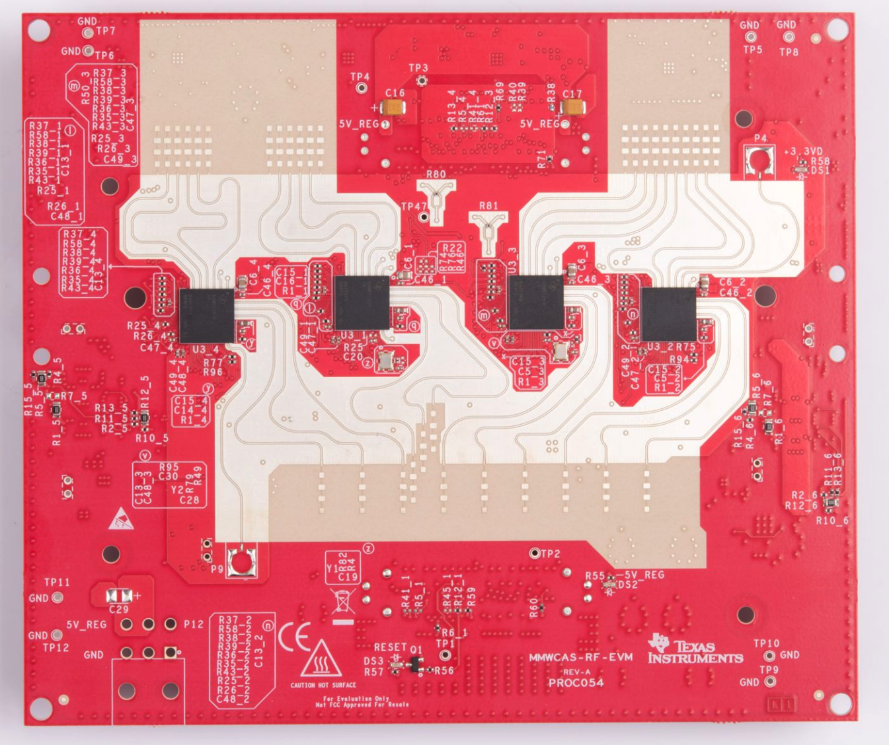
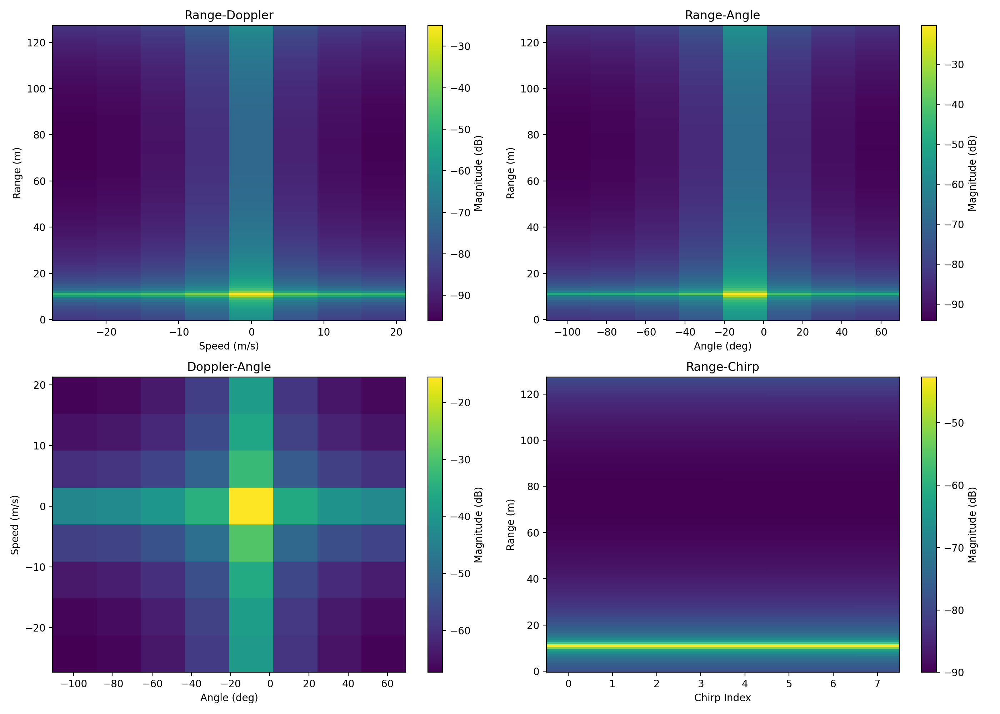
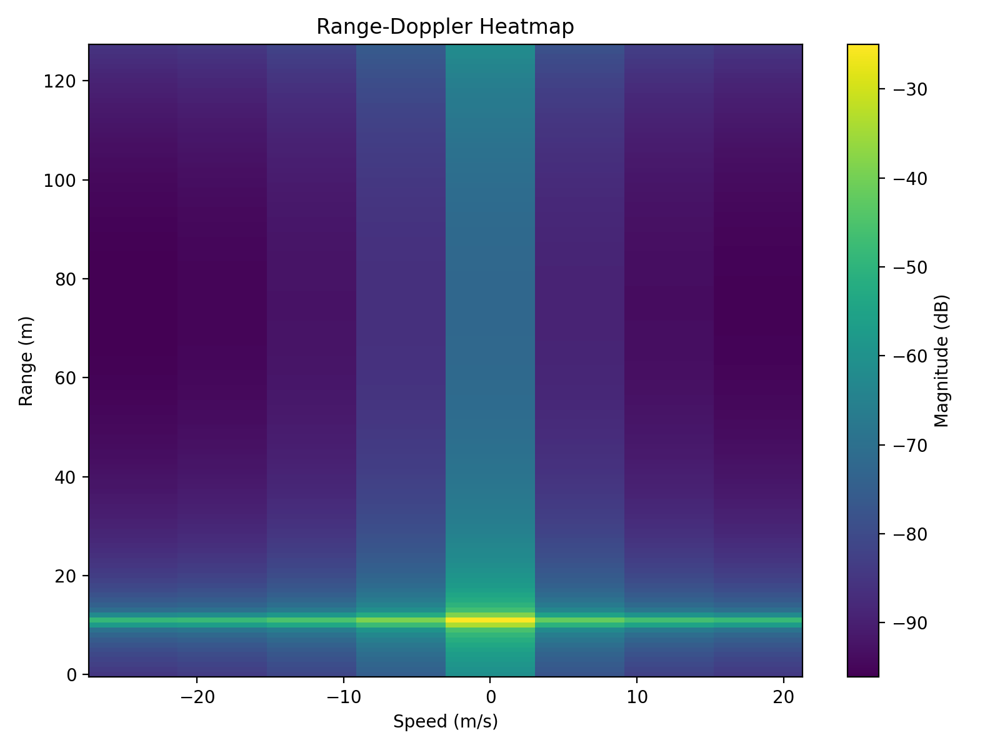
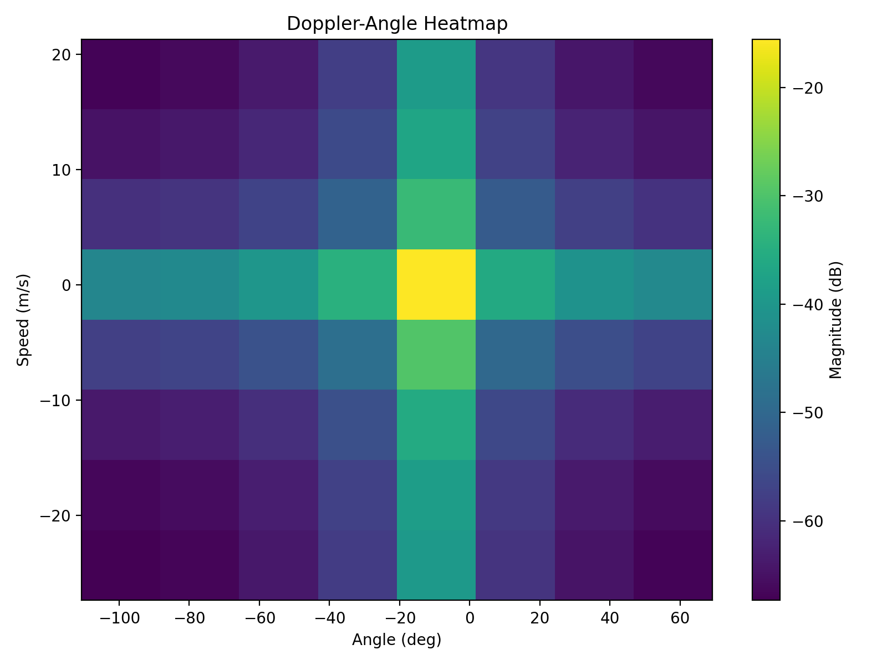
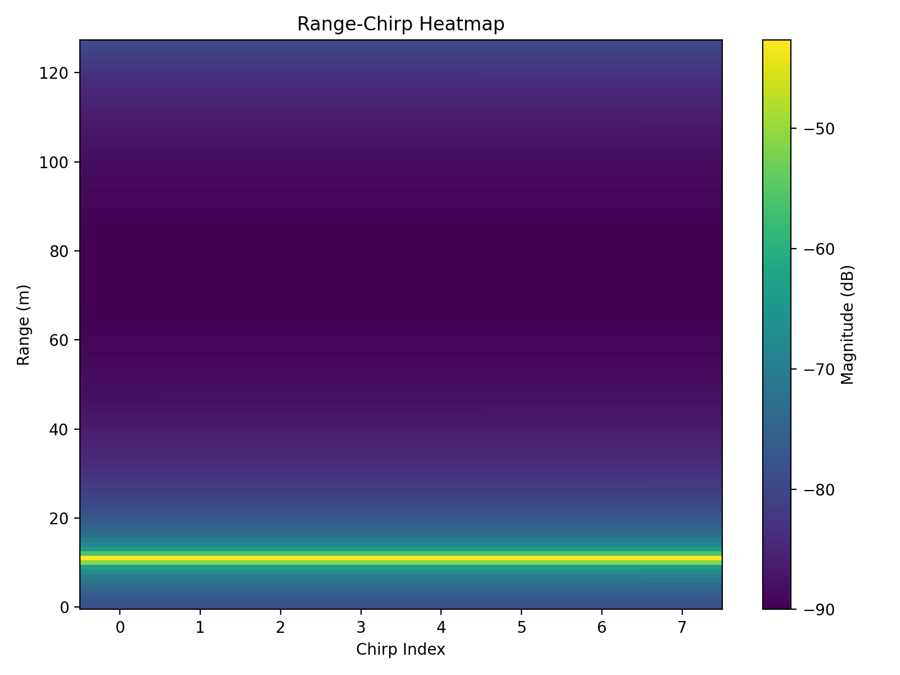

# MIMO-FMCW-Radar-Simulator-Multiprocess

`MIMO-FMCW-Radar-Simulator-Multiprocess` 是一个基于三角面片网格的 Python MIMO FMCW 雷达仿真器。系统以 3D mesh 作为目标输入，先提取朝向雷达且未被遮挡的可见面，再基于面片级散射近似生成基带雷达数据，并输出三次 FFT 的结果。

文档站点：https://billzi2016.github.io/MIMO-FMCW-Radar-Simulator-Multiprocess/

## 项目目标

本项目聚焦一条尽量直接、透明、可解释的仿真链路，核心内容包括：

- 三角面片模型输入
- 朝向雷达的面提取
- 基于连线相交的遮挡判断
- 面片级散射近似
- Range FFT、Doppler FFT、Angle FFT
- 基于 `cpu_count() // 2` 的多进程执行

当前实现有意保持最简建模路径：

- 不加噪声
- 不做滤波
- 不做 CFAR
- 不做 MUSIC
- 不包含额外的微多普勒专用后处理

## 核心流程

1. 读取 `OBJ`、`STL` 或 `GLB` 格式的 3D 模型，并统一转换为三角面片。
2. 对目标施加刚体平移和固定欧拉角旋转，构造逐 chirp 场景。
3. 根据面法向量与雷达视线方向的夹角，筛选朝向雷达的候选面。
4. 从雷达到面中心发射射线，与其他三角面做相交判断，剔除被遮挡面。
5. 将每个可见面近似为一个散射单元，幅度由面面积、入射角和距离共同决定。
6. 为所有 TX/RX 通道合成去斜后的基带雷达数据立方体。
7. 依次执行距离、速度、角度三次 FFT，得到三维频谱结果。

## 项目结构

```text
MIMO-FMCW-Radar-Simulator-Multiprocess/
├── README.md
├── README_CN.md
├── fmcw-2243-cascade.png
├── pyproject.toml
├── profiles/
│   ├── awr1642.toml
│   ├── awr2243.toml
│   ├── awr2243_cascade.toml
│   └── iwr6843.toml
├── examples/
│   ├── meshes/
│   │   ├── box.obj
│   │   └── Thanh.glb
│   ├── output/
│   └── plot/
│       ├── output/
│       └── plot_thanh_run.py
└── src/
    └── mimo_fmcw_radar_simulator_multiprocess/
        ├── __init__.py
        ├── __main__.py
        ├── fft_pipeline.py
        ├── geometry.py
        ├── main.py
        ├── mesh_loader.py
        ├── multiprocess_engine.py
        ├── profile_loader.py
        ├── radar_model.py
        ├── scatter_model.py
        ├── signal_synth.py
        └── visibility.py
```

## 安装方式

```bash
pip install -e .
```

## 运行方式

运行默认示例：

```bash
python -m mimo_fmcw_radar_simulator_multiprocess \
  --mesh examples/meshes/box.obj \
  --output examples/output/box_run.npz
```

运行人体 mesh 示例：

```bash
python -m mimo_fmcw_radar_simulator_multiprocess \
  --mesh examples/meshes/Thanh.glb \
  --max-faces 1200 \
  --num-chirps 16 \
  --output examples/output/thanh_run.npz
```

如果从源码目录直接运行，也可以显式指定：

```bash
PYTHONPATH=src python -m mimo_fmcw_radar_simulator_multiprocess \
  --mesh examples/meshes/Thanh.glb \
  --max-faces 1200 \
  --num-chirps 16 \
  --output examples/output/thanh_run.npz
```

按名称直接加载雷达 profile：

```bash
python -m mimo_fmcw_radar_simulator_multiprocess \
  --profile awr2243 \
  --mesh examples/meshes/box.obj \
  --output examples/output/awr2243_run.npz
```

使用具有 86 个水平有效虚拟阵元的四芯片 AWR2243 Cascade profile：

```bash
python -m mimo_fmcw_radar_simulator_multiprocess \
  --profile awr2243_cascade \
  --mesh examples/meshes/box.obj \
  --output examples/output/awr2243_cascade_run.npz
```

内置 profile：

| Profile | 频率范围 | 物理阵列 | 水平有效虚拟通道 |
| --- | --- | --- | ---: |
| `awr1642` | 76-81 GHz | 2 TX x 4 RX | 8 |
| `awr2243` | 76-81 GHz | 3 TX x 4 RX | 12 |
| `iwr6843` | 60-64 GHz | 3 TX x 4 RX | 12 |
| `awr2243_cascade` | 76-81 GHz | 12 TX x 16 RX | 86 |

显式传入的雷达命令行参数会覆盖 profile 中的对应值。

## 输入与输出

### 输入

- 目标 3D mesh：`OBJ / STL / GLB`
- 雷达参数：载频、带宽、chirp 时长、ADC 采样点数、chirp 数、TX/RX 数量
- 目标运动参数：初始位置、速度、欧拉角姿态
- 可选面数预算：`--max-faces`

### 输出

输出文件为压缩 `NPZ`，包含以下关键数组：

- `rdc`：原始雷达数据立方体
- `range_fft`：距离向 FFT 结果
- `range_doppler_cube`：距离-速度立方体
- `range_doppler_map`：非相干距离-速度图
- `range_angle_map`：非相干距离-角度图
- `range_doppler_angle_cube`：三维 FFT 结果
- `range_axis_m`：距离坐标轴
- `doppler_axis_m_s`：速度坐标轴
- `angle_axis_deg`：角度坐标轴

## 建模说明

- 阵列采用简化的 TDM 风格虚拟阵列布局。
- 目标当前按刚体 mesh 建模，默认速度恒定。
- 遮挡判断基于“雷达到面中心射线”与完整三角网格的相交测试。
- 每个可见三角面片被近似为一个散射中心，位置取面中心。
- 面片反射强度采用基础几何近似，便于直接观察仿真链路。

## 面数预算说明

对于高面数 mesh，当前版本的遮挡判断采用直接射线-三角面相交方法，计算成本会随面数上升较快。为保证早期实验可控，命令行支持 `--max-faces` 参数，可在仿真前对输入 mesh 做面数预算裁剪，用于控制可见性阶段的计算开销。

## 示例模型来源

项目中的示例人体模型 `examples/meshes/Thanh.glb` 来自公开 GitHub 仓库 `hmthanh/3d-human-model`：

- 仓库地址：`https://github.com/hmthanh/3d-human-model`
- 文件直链：`https://raw.githubusercontent.com/hmthanh/3d-human-model/main/Thanh.glb`

## 可视化结果

下图展示的是当前仿真场景所对应的真实目标对象实物图。



下面这些 PNG 结果图由独立绘图脚本 `examples/plot/` 基于 `examples/output/thanh_run.npz` 生成。

### 总览热力图



### 距离-速度热力图



### 距离-角度热力图


### 速度-角度热力图



### 距离-Chirp 热力图



## 默认参数

默认示例参数如下：

- 载频：`77 GHz`
- 带宽：`150 MHz`
- chirp 时长：`40 us`
- 每个 chirp 的 ADC 采样点数：`256`
- 每帧 chirp 数：`64`
- 阵列规模：`2 TX x 4 RX`

## 当前边界

当前版本侧重最小可运行链路，重点在于 mesh 可见面筛选、基础散射建模、RDC 合成和三次 FFT。若继续扩展，可进一步引入更高效的遮挡加速结构、更细化的散射模型、结果可视化以及更复杂的目标运动建模。

## 免责声明

Texas Instruments、TI、AWR1642、AWR2243 和 IWR6843 是 Texas Instruments Incorporated 的商标或产品名称。本项目是独立、非官方的仿真工具，仅用于教育和研究目的。本项目与 Texas Instruments Incorporated 不存在任何隶属、认可、赞助或其他关联关系。

本仿真器基于通用的 FMCW 和 MIMO 雷达原理独立实现，未使用 TI 的源代码、固件、SDK 组件、专有算法、保密信息或复制的技术文档。项目对 TI 产品名称及公开规格参数的引用，仅用于标识示例硬件 profile 和描述事实性工作参数。本仓库中的仿真模型、profile 格式和软件实现均为独立开发。
